## Hi there, I'm Zahra ! 🎀

  

I’m a Computer Science student in France, with a strong interest in building thoughtful and aesthetic digital experiences.

I enjoy working across web development, software engineering, game development and art, where logic meets creativity. I’m comfortable turning ideas into concrete projects from web applications and UML modeling to interactive systems.

Beyond code, I care deeply about design, structure, and clarity, and I often use tools like Figma and sketching to shape ideas before bringing them to life.

✨ Always curious, always learning, and always excited to create meaningful projects that blend creativity and technology. ✨

---

### My current stack: 

  

---

### Languages currently learning:

  

(and always learning more).

---

### Dev Tools: 

  

and my trusty IPad for brainstorming.

--- 

### Can work on  : 

  

---

I’ve worked on projects during my BecomTech training and my BUT studies, but my favorite so far is the e-commerce website named as ScentMeIfYouCan.

Fun Facts:

- I have a cat named Cosmos 🐱
- I hate fizzy drinks (water or fresh juice, please!)
- I’m writing a webtoon in my free time
- Hobbies: drawing, gaming, gym, and Formula 1

---

### Some random dev stats : 

  
  

--- 
Want to collaborate or chat about tech, design, or Valorant?

### 📬  Let’s connect! 

  
  
  
  

  
  

